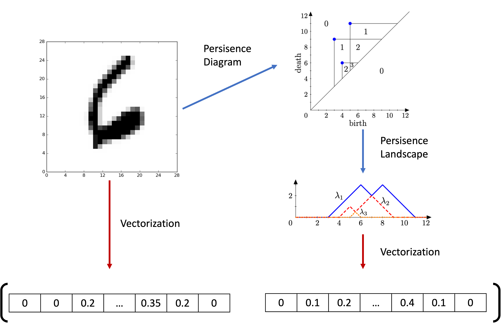
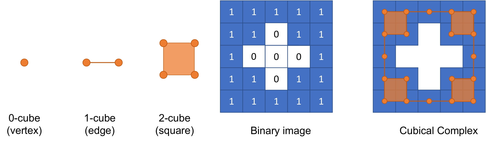

# TDA - Topological Data Analysis

혼자 TDA(Topological Data Analysis, 위상적 데이터 분석)를 공부하며 정리한 노트북과 발표 자료입니다.

이 프로젝트는 TDA를 처음 공부하는 입장에서 **점 구름(point cloud)과 이미지 데이터에서 위상적 특징을 어떻게 추출하는지**를 단계적으로 실습합니다. 핵심 흐름은 Vietoris-Rips complex, Persistent Homology, Persistence Diagram, Vectorization, 그리고 MNIST 이미지 데이터에 대한 Cubical Persistence 적용입니다.

## 프로젝트 목적

TDA는 데이터를 단순한 좌표나 픽셀 값의 모음으로만 보지 않고, 데이터가 가진 연결성, 구멍, 빈 공간 같은 위상적 구조를 분석하는 방법입니다.

이 노트북은 다음 질문을 따라갑니다.

- 점들이 흩어져 있을 때 연결성분과 구멍은 어떻게 생기고 사라지는가?
- 이 정보를 Persistence Diagram으로 어떻게 표현하는가?
- Persistence Diagram은 왜 바로 머신러닝 입력으로 쓰기 어려운가?
- Diagram의 정보를 어떻게 벡터로 바꾸는가?
- 이미지 데이터에서는 점 구름 대신 어떤 Complex와 Filtration을 사용하는가?
- TDA가 실제 데이터 분석에 어떤 장점과 한계를 가지는가?

## 전체 학습 흐름

노트북 `TDA 코드 정리.ipynb`의 흐름은 다음과 같습니다.

```text
TDA와 위상적 특징의 직관
-> 2차원 point cloud 예제 생성
-> epsilon 변화에 따른 Vietoris-Rips complex 시각화
-> 연결성분과 구멍의 birth/death 이해
-> Persistence Diagram 계산과 해석
-> 서로 비슷해 보이는 point cloud를 TDA로 비교
-> Sphere, Torus, Mobius band, Klein bottle 예제 생성
-> H0, H1, H2 Persistent Homology 계산
-> Persistence Diagram Vectorization 방법 정리
-> MNIST 이미지 데이터에 TDA 적용
-> Binarizer, Radial Filtration, Cubical Persistence 실습
-> sklearn Pipeline으로 TDA feature 추출 자동화
-> TDA 라이브러리와 실제 적용상의 한계 정리
```

## 1. Vietoris-Rips Complex로 TDA 직관 만들기

처음에는 8개의 점으로 이루어진 간단한 2차원 point cloud를 만듭니다.

```python
point_cloud = np.array([
    [-2.0, 8.0],
    [6.0, 8.0],
    [-2.0, 2.0],
    [7.0, 3.0],
    [27.0, 3.0],
    [20.0, 6.0],
    [20.0, 0.0],
    [9.0, -7.0],
])
```

그 다음 `epsilon` 값을 조금씩 키워가며 Vietoris-Rips complex가 어떻게 변하는지 직접 시각화합니다.

- `epsilon`이 작을 때는 점들이 서로 떨어져 있어 여러 개의 연결성분이 존재합니다.
- `epsilon`이 커지면 가까운 점들이 edge로 연결됩니다.
- 세 edge가 삼각형을 이루면 face가 채워집니다.
- 어떤 순간에는 loop가 생기고, 더 큰 `epsilon`에서는 그 loop가 채워져 사라집니다.

이 과정을 통해 TDA의 기본 관점을 설명합니다. 즉, 위상적 특징은 고정된 하나의 값이 아니라 filtration parameter가 변함에 따라 **탄생(birth)** 하고 **소멸(death)** 합니다.

## 2. Persistent Homology와 Persistence Diagram

노트북에서는 `giotto-tda`의 `VietorisRipsPersistence`를 사용해 point cloud의 Persistent Homology를 계산합니다.

```python
VR = VietorisRipsPersistence(
    homology_dimensions=[0, 1],
    reduced_homology=False,
)
PD = VR.fit_transform(point_cloud[None, :, :])
```

Persistence Diagram의 각 점은 다음 정보를 가집니다.

```text
[birth time, death time, homology dimension]
```

Homology dimension은 다음처럼 해석합니다.

| 차원 | 의미 |
| --- | --- |
| H0 | 연결성분 |
| H1 | loop 또는 구멍 |
| H2 | void 또는 빈 공간 |

노트북은 첫 예제에서 H0 연결성분들이 언제 합쳐지는지, H1 구멍이 언제 생기고 사라지는지를 Persistence Diagram으로 확인합니다. 대각선에 가까운 점은 지속 시간이 짧기 때문에 노이즈로 해석될 수 있다는 점도 함께 설명합니다.

## 3. 눈으로 비슷한 point cloud를 TDA로 구별하기

다음 단계에서는 눈으로 보기에는 비슷하지만 생성 과정이 다른 두 point cloud를 비교합니다.

1. 정규분포에서 생성한 2차원 point cloud
2. 두 원 형태에서 샘플링한 뒤 노이즈를 준 point cloud

두 데이터 모두 산점도만 보면 명확히 구별하기 어렵지만, Persistence Diagram을 보면 두 번째 데이터에서 H1, 즉 loop에 해당하는 persistence가 더 강하게 나타납니다.

이 실험의 목적은 TDA가 좌표값 자체보다 데이터 안에 숨어 있는 위상적 패턴을 잡아낼 수 있음을 보여주는 것입니다.

## 4. 3차원 위상 공간 예제

`generate_data.py`에는 대표적인 3차원 위상 공간에서 point cloud를 생성하는 `PointCloud` 클래스가 들어 있습니다.

생성 가능한 데이터는 다음과 같습니다.

- Sphere
- Torus
- Mobius band
- Klein bottle

노트북에서는 각 데이터에 대해 `VietorisRipsPersistence`를 적용하고, 3차원 데이터이므로 `homology_dimensions=[0, 1, 2]`를 사용합니다.

```python
persistence = VietorisRipsPersistence(
    metric="euclidean",
    homology_dimensions=[0, 1, 2],
    n_jobs=6,
    collapse_edges=True,
)
```

이 부분은 H0, H1뿐 아니라 H2까지 확장해, 구멍(loop)뿐 아니라 빈 공간(void)까지 추적하는 실습입니다.

## 5. Persistence Diagram Vectorization

Persistence Diagram은 데이터마다 점의 개수가 다를 수 있어서 그대로 머신러닝 모델의 입력으로 넣기 어렵습니다. 그래서 노트북은 Persistence Diagram의 정보를 고정 길이 벡터로 바꾸는 방법을 정리합니다.

다룬 vectorization 방법은 다음과 같습니다.

| 방법 | 설명 |
| --- | --- |
| `Amplitude` | homology 차원별로 대각선에서 가장 멀리 떨어진 persistence 크기를 계산 |
| `NumberOfPoints` | homology 차원별 diagram point 개수 계산 |
| `PersistenceEntropy` | persistence 분포의 entropy 계산 |
| `PersistenceLandscape` | persistence 정보를 함수 형태로 바꾸고 구간별 값으로 벡터화 |

노트북에서는 특히 `PersistenceLandscape`를 많이 쓰이는 방법으로 소개합니다. `n_layers`, `n_bins` 같은 하이퍼파라미터가 벡터의 표현력과 크기를 조절한다는 점도 함께 실험합니다.



## 6. MNIST 이미지 데이터에 TDA 적용하기

후반부에서는 MNIST 손글씨 숫자 이미지에 TDA를 적용합니다.

여기서 강조하는 관점은 다음과 같습니다.

사람은 서로 다른 글씨체의 숫자 8을 볼 때 픽셀값 하나하나를 외워서 판단하지 않습니다. 숫자 8이 가진 "위아래 두 개의 구멍" 같은 구조적 특징을 보고 같은 숫자라고 인식합니다. TDA도 이와 비슷하게 이미지의 위상적 특징을 추출하려는 접근입니다.

MNIST 데이터는 원래 `28 x 28 = 784`개의 픽셀 변수를 가지지만, TDA를 사용하면 이미지의 위상적 구조를 더 적은 feature로 요약할 수 있습니다.

## 7. 이미지 데이터: Binarizer, Radial Filtration, Cubical Persistence

이미지 데이터에는 point cloud와 다른 처리 방식이 필요합니다. 노트북에서는 다음 순서로 MNIST 숫자 이미지의 TDA feature를 추출합니다.

### Binarizer

먼저 grayscale 이미지를 흰색/검정색으로 이진화합니다.

```python
binarizer = Binarizer(threshold=0.4)
im8_binarized = binarizer.fit_transform(im8)
```

### Radial Filtration

그 다음 이미지의 특정 중심점에서 반지름을 키우는 방식으로 filtration을 만듭니다.

```python
radial_filtration = RadialFiltration(center=np.array([20, 6]))
im8_filtration = radial_filtration.fit_transform(im8_binarized)
```

Radial Filtration은 선택한 중심점 `c`로부터 거리를 기준으로 픽셀을 filtration에 포함시키는 방식입니다.

### Cubical Persistence

이미지는 격자 구조 위의 픽셀 데이터이므로, 삼각형 기반의 simplicial complex보다 사각형 기반의 cubical complex가 자연스럽습니다.

```python
cubical_persistence = CubicalPersistence(n_jobs=-1)
im8_cubical = cubical_persistence.fit_transform(im8_filtration)
```



마지막으로 이미지에서 얻은 Persistence Diagram을 `PersistenceLandscape` 또는 `Amplitude`로 벡터화합니다.

## 8. sklearn Pipeline으로 TDA feature 추출 자동화

노트북은 TDA 전처리를 `sklearn.pipeline.Pipeline`으로 묶어 한 번에 처리하는 방법도 실습합니다.

예시는 다음과 같습니다.

```python
steps = [
    ("binarizer", Binarizer(threshold=0.4)),
    ("filtration", RadialFiltration(center=np.array([20, 6]))),
    ("diagram", CubicalPersistence()),
    ("rescaling", Scaler()),
    ("amplitude", Amplitude(metric="bottleneck")),
]

pipeline = Pipeline(steps)
X_train_tda = pipeline.fit_transform(X_train)
```

또 다른 pipeline에서는 `PersistenceLandscape`를 사용해 `(7000, 2, 4)` 형태의 TDA feature를 생성합니다. 이 흐름은 TDA feature를 기존 머신러닝 모델에 넣기 위한 전처리 파이프라인으로 이해할 수 있습니다.

## 공부하면서 정리한 관점

노트북 마지막에는 TDA를 실제로 적용할 때의 장점과 한계도 정리합니다.

장점:

- 데이터의 연결성, 구멍, 빈 공간 같은 구조적 정보를 추출할 수 있습니다.
- 이미지나 point cloud에서 좌표/픽셀값만으로 보기 어려운 기하학적 패턴을 요약할 수 있습니다.
- `giotto-tda`는 `sklearn`과 유사한 API를 제공해 입문자가 실험하기 좋습니다.

한계:

- Filtration 방식, 중심점, vectorization 방법, `n_bins`, `n_layers` 같은 하이퍼파라미터의 영향을 많이 받습니다.
- 데이터에 따라 TDA feature가 실제 성능 개선으로 이어질지 확신하기 어렵습니다.
- `giotto-tda`는 사용하기 쉽지만, 더 깊은 수준의 Persistent Homology 계산에는 제약이 있을 수 있습니다.
- GUDHI 같은 라이브러리도 있지만, 실행 환경과 시각화 과정에서 다루기 어려운 점이 있었다고 기록되어 있습니다.

## 주요 파일

```text
.
├── TDA 코드 정리.ipynb
├── generate_data.py
├── plotting.py
├── TDA 발표.pptx
├── TDA 발표.pdf
├── vectorization.png
├── cubical_complex-1.jpg
├── cubical_filtration-1.jpg
└── README.md
```

파일별 역할은 다음과 같습니다.

| 파일 | 설명 |
| --- | --- |
| `TDA 코드 정리.ipynb` | TDA 개념과 실습 흐름을 정리한 메인 노트북 |
| `generate_data.py` | sphere, torus, Mobius band, Klein bottle point cloud 생성 |
| `plotting.py` | 3D point cloud 시각화 함수 |
| `TDA 발표.pptx`, `TDA 발표.pdf` | TDA 발표 자료 |
| `vectorization.png` | Persistence Landscape 등 vectorization 설명 이미지 |
| `cubical_complex-1.jpg`, `cubical_filtration-1.jpg` | Cubical complex와 filtration 설명 이미지 |

## 실행 환경

노트북은 Python 3.8.8 커널에서 작성되었습니다.

필요한 주요 패키지는 다음과 같습니다.

```bash
pip install numpy matplotlib plotly scikit-learn giotto-tda
```

MNIST 예제는 `sklearn.datasets.fetch_openml("mnist_784")`를 사용하므로 인터넷 연결이 필요할 수 있습니다.

## 요약

이 프로젝트는 TDA를 이론적으로만 정리한 것이 아니라, 작은 point cloud에서 시작해 실제 이미지 데이터까지 확장해보는 실습형 학습 기록입니다.

전체 흐름은 **Filtration을 통해 위상적 특징의 birth/death를 관찰하고, Persistence Diagram으로 정리한 뒤, Vectorization을 통해 머신러닝에 사용할 수 있는 feature로 바꾸는 과정**입니다.
